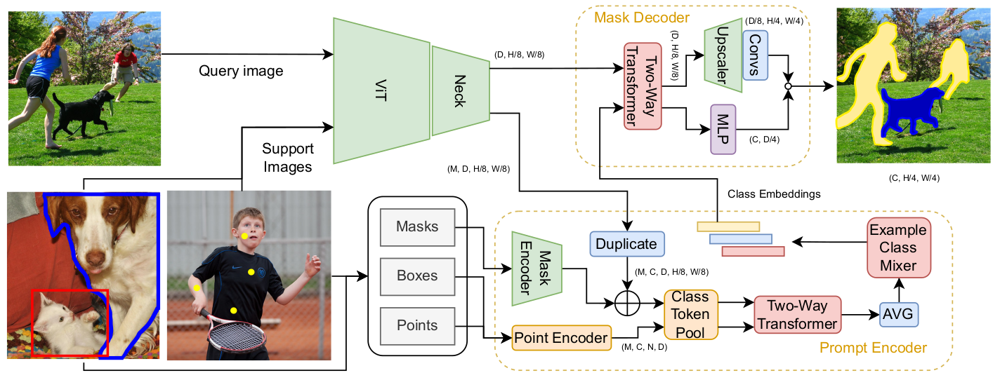

<div align="center">

# 🏷️ [Label Anything](https://pasqualedem.github.io/LabelAnything/)

### Multi-Class Few-Shot Semantic Segmentation with Visual Prompts

[](https://pasqualedem.github.io/LabelAnything/)
[](https://paperswithcode.com/sota/few-shot-semantic-segmentation-on-coco-20i-2-1?p=label-anything-multi-class-few-shot-semantic)
[](https://arxiv.org/abs/2407.02075)
[](https://ecai2025.org/)
[](https://www.python.org/downloads/)
[](LICENSE)

</div>

---

## 🌟 Overview

**Label Anything** is a novel method for multi-class few-shot semantic segmentation using visual prompts. This repository contains the official implementation of our ECAI 2025 paper, enabling precise segmentation with just a few prompted examples.

<div align="center">



*Visual prompting meets few-shot learning with a new fast and efficient architecture.*

</div>

## 🚀 Quick Start

### ⚡ One-Line Demo

Experience Label Anything instantly with our streamlined demo:

```bash
uvx --from git+https://github.com/pasqualedem/LabelAnything app
```

> **💡 Pro Tip**: This command uses [uv](https://docs.astral.sh/uv/) for lightning-fast package management and execution.

### 🛠️ Manual Installation

For development and customization:

```bash
# Clone the repository
git clone https://github.com/pasqualedem/LabelAnything.git
cd LabelAnything

# Create virtual environment with uv
uv sync
source .venv/bin/activate
```

> **⚠️ System Requirements**: Linux environment with CUDA 12.1 support

## 📦 Pre-trained Models

Access our collection of state-of-the-art checkpoints:

<div align="center">

| 🧠 Encoder | 📐 Embedding Size | 🖼️ Image Size | 📁 Fold | 🔗 Checkpoint |
|------------|-------------------|----------------|----------|---------------|
| **SAM** | 512 | 1024 | - | [](https://huggingface.co/pasqualedem/label_anything_sam_1024_coco) |
| **ViT-MAE** | 256 | 480 | - | [](https://huggingface.co/pasqualedem/label_anything_mae_480_coco) |
| **ViT-MAE** | 256 | 480 | 0 | [](https://huggingface.co/pasqualedem/label_anything_coco_fold0_mae_7a5p0t63) |

</div>

### 🔌 Model Loading

```python
from label_anything.models import LabelAnything

# Load pre-trained model
model = LabelAnything.from_pretrained("pasqualedem/label_anything_sam_1024_coco")
```

## 🎯 Training Pipeline

### 📊 Dataset Setup: COCO 2017

Prepare the COCO dataset with our automated setup:

```bash
# Navigate to data directory
cd data && mkdir coco && cd coco

# Download COCO 2017 images and 2014 annotations
wget http://images.cocodataset.org/zips/train2017.zip
wget http://images.cocodataset.org/zips/val2017.zip
wget http://images.cocodataset.org/annotations/annotations_trainval2014.zip

# Extract and organize
unzip "*.zip" && rm *.zip
mv val2017/* train2017/ && mv train2017 train_val_2017 && rm -rf val2017
```

### 🔧 Annotation Preprocessing

Synchronize filenames between images and annotations:

```bash
python main.py rename_coco20i_json --instances_path data/coco/annotations/instances_train2014.json
python main.py rename_coco20i_json --instances_path data/coco/annotations/instances_val2014.json
```

### 🧠 Feature Extraction

#### SAM Encoder Setup
```bash
# Download SAM checkpoint
cd checkpoints
wget https://dl.fbaipublicfiles.com/segment_anything/sam_vit_b_01ec64.pth

# Extract embeddings (optional but recommended for speed)
mkdir -p data/coco/vit_sam_embeddings/{last_hidden_state,last_block_state}
python main.py generate_embeddings \
  --encoder vit_b \
  --checkpoint checkpoints/sam_vit_b_01ec64.pth \
  --use_sam_checkpoint \
  --directory data/coco/train_val_2017 \
  --batch_size 16 \
  --num_workers 8 \
  --outfolder data/coco/vit_sam_embeddings/last_hidden_state \
  --last_block_dir data/coco/vit_sam_embeddings/last_block_state \
  --custom_preprocess
```

#### ViT-MAE Encoders
```bash
# Base ViT-MAE (1024px)
python main.py generate_embeddings \
  --encoder vit_b_mae \
  --directory data/coco/train_val_2017 \
  --batch_size 32 \
  --outfolder data/coco/embeddings_vit_mae_1024/ \
  --model_name facebook/vit-mae-base \
  --image_resolution 1024 \
  --huggingface

# Base ViT-MAE (480px)
python main.py generate_embeddings \
  --encoder vit_b_mae \
  --directory data/coco/train_val_2017 \
  --batch_size 64 \
  --outfolder data/coco/embeddings_vit_mae_480 \
  --model_name facebook/vit-mae-base \
  --image_resolution 480 \
  --huggingface

# Large ViT-MAE (480px)
python main.py generate_embeddings \
  --encoder vit_l_mae \
  --directory data/coco/train_val_2017 \
  --batch_size 64 \
  --outfolder data/coco/embeddings_vit_mae_l_480 \
  --model_name facebook/vit-mae-large \
  --image_resolution 480 \
  --huggingface

# DinoV3
python main.py generate_embeddings \
  --directory data/coco/train_val_2017 \
  --batch_size 64 \
  --outfolder data/coco/embeddings_dinov3_480 \
  --model_name facebook/dinov3-vitb16-pretrain-lvd1689m \
  --image_resolution 480 \
  --huggingface
```

### 🏋️ Training & Evaluation

#### Single GPU Training
```bash
# Train with pre-extracted embeddings
python main.py experiment --parameters="parameters/trainval/coco20i/mae.yaml"

# Train without pre-extracted embeddings
python main.py experiment --parameters="parameters/trainval/coco20i/mae_noembs.yaml"
```

#### Multi-GPU Training
```bash
# Accelerated training for faster convergence
accelerate launch --multi_gpu main.py experiment --parameters="parameters/trainval/coco20i/mae.yaml"
```

> **📈 Experiment Tracking**: All experiments are automatically logged to [Weights & Biases](https://wandb.ai/site). Results are saved in `offline/wandb/run-<date>-<run_id>/files/`.

## 🏗️ Project Architecture

```
📦 LabelAnything
    🌟 Core Components
    ├── label_anything/          # 🔧 Main codebase
    │   ├── **main**.py          # 🚪 CLI entry point
    │   ├── cli.py               # 💻 Command interface
    │   ├── data/                # 📊 Dataset handling
    │   ├── demo/                # 🎮 Interactive demos
    │   ├── experiment/          # 🧪 Training workflows
    │   ├── models/              # 🤖 Neural architectures
    │   ├── loss/                # 📉 Loss functions
    │   └── utils/               # 🛠️ Utilities
    └── parameters/              # ⚙️ Configuration files
        ├── trainval/            # 📚 Training configs
        ├── validation/          # 📖 Validation configs
        └── test/                # 🧪 Testing configs

    📚 Resources
    ├── notebooks/               # 📓 Analysis & demos
    ├── assets/                  # 🖼️ Media files
    ├── data/                    # 💾 Dataset storage
    └── checkpoints/             # 🏆 Model weights

    🚀 Deployment
    ├── slurm/                   # ⚡ HPC job scripts
    └── app.py                   # 🌐 Web application
```

## 🎨 Key Features

- **🎯 Few-Shot Learning**: Achieve remarkable results with minimal training data
- **🖼️ Visual Prompting**: Intuitive interaction through visual cues
- **⚡ Multi-GPU Support**: Accelerated training on modern hardware
- **🔄 Cross-Validation**: Robust 4-fold evaluation protocol
- **📊 Rich Logging**: Comprehensive experiment tracking
- **🤗 HuggingFace Integration**: Seamless model sharing and deployment

## 📄 Citation

If you find Label Anything useful in your research, please cite our work:

```bibtex
@inproceedings{labelanything2025,
  title={LabelAnything: Multi-Class Few-Shot Semantic Segmentation with Visual Prompts},
  author={De Marinis, Pasquale and Fanelli, Nicola and Scaringi, Raffaele and Colonna, Emanuele and Fiameni, Giuseppe and Vessio, Gennaro and Castellano, Giovanna},
  booktitle={ECAI 2025},
  year={2025}
}
```

## 🤝 Contributing

We welcome contributions! Feel free to:
- 🐛 Report bugs by opening an issue
- 💡 Suggest new features or improvements
- 🔧 Submit pull requests with bug fixes or enhancements
- 📚 Improve documentation and examples

## 📜 License

This project is licensed under the MIT License - see the [LICENSE](LICENSE) file for details.

---

<div align="center">

**Made with ❤️ by the CilabUniba Label Anything Team**

</div>
